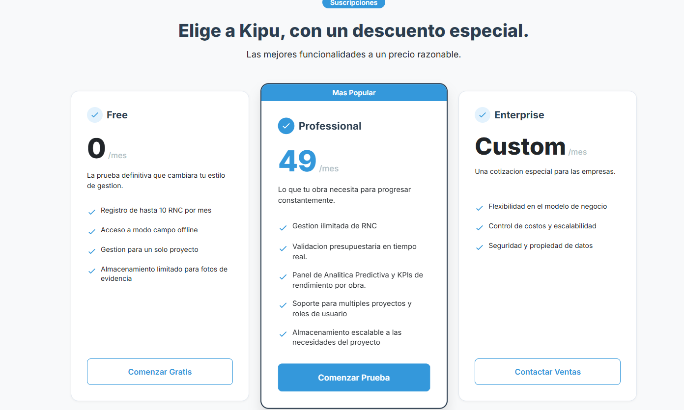
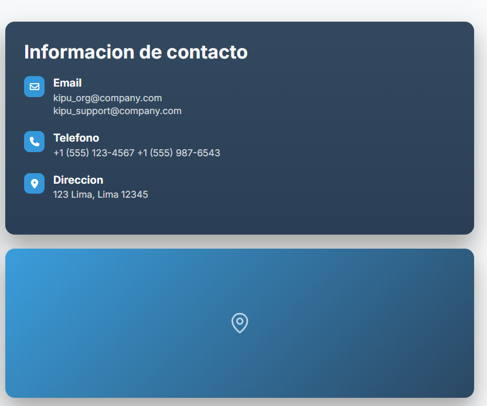
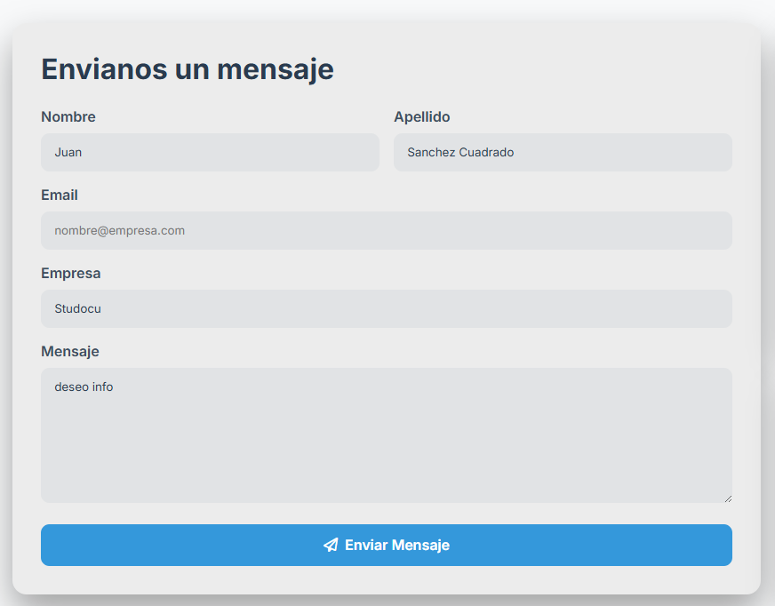
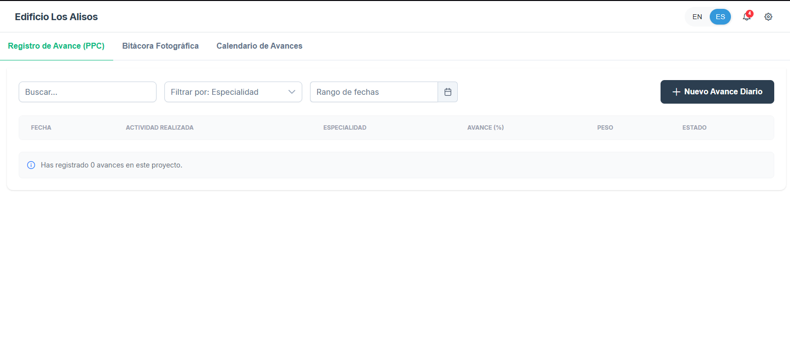
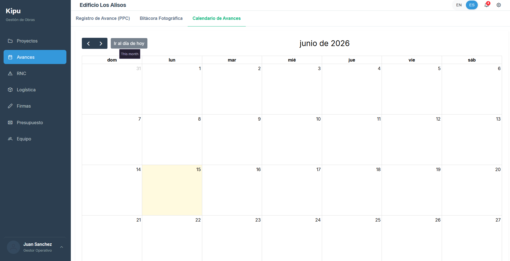
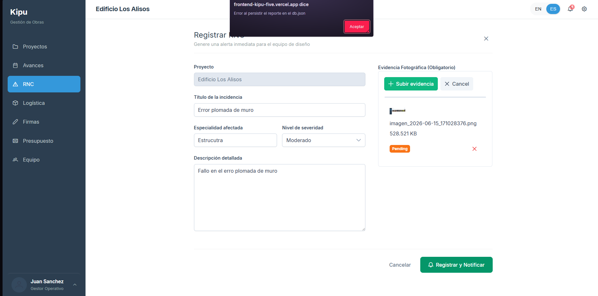
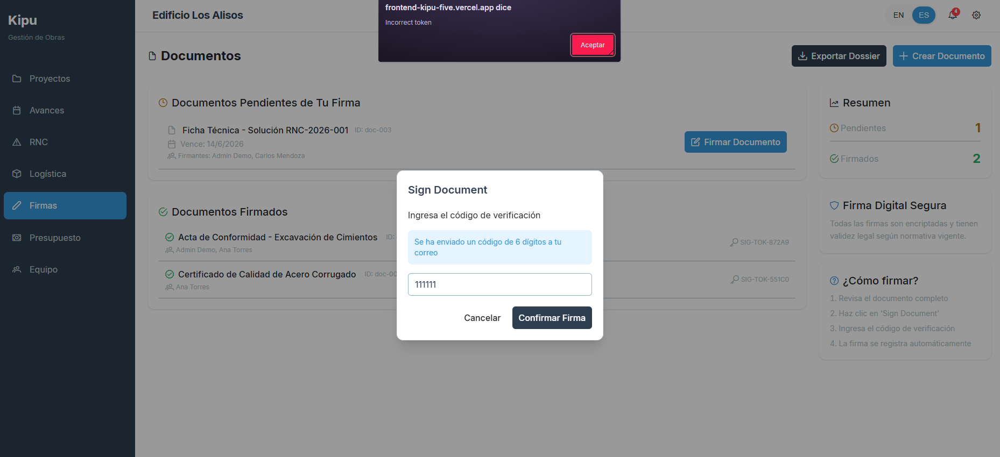

### 5.3.3. UX Heuristics & Principles Evaluation

#### UX Heuristics & Principles Evaluation  
**Usability – Inclusive Design – Information Architecture**

| Campo | Descripción |
|---|---|
| Carrera | Ingeniería de Software |
| Curso | Aplicaciones Web |
| Sección | 1ASI0730 |
| Auditor | AutoServiceOS |
| Site o App evaluada | Kipu |
| Tipo de evaluación | Evaluación de User Experience según heurísticas |
| Alcance | Landing Page y Frontend Web Application |

---

#### Tareas evaluadas

El alcance de esta evaluación incluye la revisión de usabilidad de las siguientes tareas:

1. Visualización de la landing page.
2. Navegación por las secciones principales de la landing page.
3. Revisión de la información de planes y contacto.
4. Envío de formulario de contacto.
5. Inicio de sesión y acceso al frontend interno.
6. Selección de proyecto.
7. Registro de avance diario.
8. Visualización de avances en calendario.
9. Uso de bitácora fotográfica.
10. Registro de RNC con evidencia fotográfica.
11. Firma de documento mediante código de verificación.

No están incluidas en esta versión de la evaluación las siguientes tareas:

1. Validación completa de seguridad del backend.
2. Pruebas de carga o rendimiento.
3. Revisión profunda del código fuente.
4. Validación real de pasarelas de pago.
5. Validación legal de firma digital.
6. Pruebas con usuarios finales reales.

---

#### Escala de severidad

| Nivel | Descripción |
|---|---|
| 1 | Problema superficial o funcionalidad simulada. No bloquea el flujo principal y puede ser corregido si existe disponibilidad de tiempo. |
| 2 | Problema menor. Puede generar confusión o afectar la percepción de calidad, pero el usuario puede continuar usando el sistema. |
| 3 | Problema mayor. Ocurre con frecuencia o dificulta que el usuario entienda cómo recuperarse del error. Debe corregirse con prioridad alta. |
| 4 | Problema muy grave. Impide completar una tarea principal del sistema. Debe corregirse antes del lanzamiento. |

---

#### Tabla resumen de problemas encontrados

| # | Problema | Escala de severidad | Heurística / Principio violado |
|---|---|---:|---|
| 1 | La landing page presenta errores de ortografía y ausencia de tildes en varios textos. | 2 | Usability: Consistency and standards / Information Architecture: Is it understandable? |
| 2 | El plan Professional muestra el precio como `49 /mes`, pero no indica la moneda. | 2 | Information Architecture: Is it findable? / Information Architecture: Is it understandable? |
| 3 | La sección de contacto muestra un bloque de mapa vacío o no funcional. | 2 | Usability: Match between system and the real world / Information Architecture: Is it useful? |
| 4 | El formulario de contacto redirige a una página técnica `405 Not Allowed` al enviar campos vacíos, incompletos o completos. | 4 | Usability: Help users recognize, diagnose, and recover from errors / Information Architecture: Is it usable? |
| 5 | El formulario de contacto permite intentar el envío sin validar correctamente todos los campos obligatorios. | 3 | Usability: Error prevention |
| 6 | El formulario de contacto no muestra mensajes de carga, éxito o error dentro de la interfaz. | 3 | Usability: Visibility of system status |
| 7 | En el módulo Avances, el avance diario no se registra ni se refleja en la tabla o calendario. | 1 | Usability: Visibility of system status / Information Architecture: Is it usable? |
| 8 | El calendario de avances aparece vacío incluso después de intentar registrar un avance. | 1 | Usability: Visibility of system status |
| 9 | Los botones de subir imágenes y exportar no ejecutan una acción visible para el usuario. | 1 | Usability: Visibility of system status / Usability: Match between system and the real world |
| 10 | Al registrar un RNC con evidencia, el sistema muestra el mensaje técnico `Error al persistir el reporte en el db.json`. | 3 | Usability: Help users recognize, diagnose, and recover from errors |
| 11 | Al firmar un documento con un código incorrecto, el sistema muestra el mensaje técnico `Incorrect token`. | 3 | Usability: Help users recognize, diagnose, and recover from errors / Usability: Match between system and the real world |

---

#### Descripción de problemas

---

#### Problema #1: La landing page presenta errores de ortografía y ausencia de tildes

**Severidad:** 2  
**Heurística violada:** Usability: Consistency and standards / Information Architecture: Is it understandable?

**Problema:**  
Durante la revisión de la landing page se identificaron textos sin tildes o con redacción inconsistente. Algunos ejemplos son: `Minimo riesgo, maxima rentabilidad`, `Ver Demostracion`, `Caracteristicas`, `Validacion de Presupuesto`, `Sincronizacion digital`, `Informacion de contacto`, `Telefono` y `Direccion`.

Este problema no bloquea el uso de la plataforma, pero afecta la percepción de calidad, formalidad y confiabilidad del producto. Además, genera una experiencia menos cuidada para el usuario final.

**Evidencia:**  

**Recomendación:**  
Corregir los textos visibles en la interfaz aplicando tildes y una redacción uniforme. Por ejemplo:

- `Mínimo riesgo, máxima rentabilidad`
- `Ver demostración`
- `Características`
- `Validación de presupuesto`
- `Sincronización digital`
- `Información de contacto`
- `Teléfono`
- `Dirección`

---

#### Problema #2: El precio del plan Professional no indica moneda

**Severidad:** 2  
**Heurística violada:** Information Architecture: Is it findable? / Information Architecture: Is it understandable?

**Problema:**  
En la sección de planes, el plan Professional muestra el precio como `49 /mes`, pero no especifica si el monto está expresado en soles, dólares u otra moneda. Esto puede generar dudas en el usuario al momento de comparar planes o tomar una decisión de compra.

La información económica debe ser clara, especialmente en una sección orientada a conversión comercial.

**Evidencia:**  

**Recomendación:**  
Indicar explícitamente la moneda del plan. Por ejemplo:

- `S/ 49 / mes`
- `US$ 49 / mes`

Además, se recomienda mantener el mismo formato de precios en todos los planes para reforzar la consistencia visual y textual.

---

#### Problema #3: La sección de contacto muestra un mapa vacío o no funcional

**Severidad:** 2  
**Heurística violada:** Usability: Match between system and the real world / Information Architecture: Is it useful?

**Problema:**  
En la sección de contacto se observa un bloque visual que representa un mapa o ubicación, pero únicamente muestra un ícono y no contiene un mapa real, dirección interactiva o enlace hacia una ubicación externa.

Esto puede generar la percepción de que la sección está incompleta, especialmente porque el usuario espera encontrar información útil para ubicar o contactar a la empresa.

**Evidencia:**  

**Recomendación:**  
Reemplazar el bloque vacío por un mapa embebido, una imagen de ubicación o un botón que redirija a Google Maps. Si la ubicación aún no está definida, se recomienda mostrar un mensaje claro como:

`Ubicación referencial disponible próximamente.`

---

#### Problema #4: El formulario de contacto redirige a una página técnica 405 Not Allowed

**Severidad:** 4  
**Heurística violada:** Usability: Help users recognize, diagnose, and recover from errors / Information Architecture: Is it usable?

**Problema:**  
Al presionar el botón `Enviar Mensaje` en el formulario de contacto, el sistema redirige a una página técnica con el mensaje `405 Not Allowed`. Este comportamiento ocurre cuando el formulario está vacío, cuando faltan campos y también cuando todos los campos se completan correctamente.

El usuario no recibe una explicación clara sobre qué ocurrió, qué campo debe corregir o si el mensaje fue enviado correctamente. Además, al mostrar una página técnica externa al diseño de la aplicación, se rompe completamente el flujo de contacto.

Este problema es crítico porque impide completar una tarea principal de la landing page: comunicarse con la empresa.

**Evidencia:**  

**Recomendación:**  
Evitar que el formulario redirija a una página técnica. En su lugar, se debe validar el formulario desde la interfaz y mostrar mensajes comprensibles. Por ejemplo:

- `El nombre es obligatorio.`
- `El apellido es obligatorio.`
- `El correo electrónico es obligatorio.`
- `El mensaje es obligatorio.`
- `Mensaje enviado correctamente.`
- `No se pudo enviar el mensaje. Inténtalo nuevamente.`

---

#### Problema #5: El formulario de contacto no previene errores antes del envío

**Severidad:** 3  
**Heurística violada:** Usability: Error prevention

**Problema:**  
El formulario permite intentar el envío aunque existan campos vacíos o incompletos. Aunque el campo de correo sí valida que exista un formato con `@`, el resto de campos no evita correctamente que el usuario avance hacia un error técnico.

El sistema debería prevenir el error antes de realizar el envío, especialmente porque el usuario puede no saber qué información falta.

**Evidencia:**  

**Recomendación:**  
Agregar validaciones frontend antes del envío. Se recomienda:

- Marcar campos obligatorios con `required`.
- Mostrar mensajes debajo de cada campo.
- Resaltar visualmente los campos con error.
- Evitar el envío si falta información.
- Deshabilitar el botón de envío hasta que el formulario sea válido.

---

#### Problema #6: El formulario de contacto no muestra el estado del envío

**Severidad:** 3  
**Heurística violada:** Usability: Visibility of system status

**Problema:**  
Cuando el usuario envía el formulario, el sistema no muestra si el mensaje se está enviando, si fue recibido correctamente o si ocurrió un error recuperable. En lugar de ello, el usuario es enviado directamente a una pantalla técnica.

Esto impide que el usuario conozca el estado real de la acción realizada.

**Evidencia:**  

**Recomendación:**  
Mostrar retroalimentación clara dentro de la misma interfaz. Por ejemplo:

- `Enviando mensaje...`
- `Mensaje enviado correctamente.`
- `No se pudo enviar el mensaje. Intenta nuevamente más tarde.`

También se recomienda usar un componente visual como toast, snackbar o mensaje inline.

---

#### Problema #7: El avance diario no se registra ni aparece en el calendario

**Severidad:** 1  
**Heurística violada:** Usability: Visibility of system status / Information Architecture: Is it usable?

**Problema:**  
En el módulo `Avances`, al intentar crear un nuevo avance diario, el registro no se agrega a la tabla de avances y tampoco se refleja en el calendario.

Se considera una severidad baja debido a que esta funcionalidad puede estar simulada o depender de una persistencia deshabilitada para la versión evaluada. Sin embargo, desde la experiencia del usuario, la interfaz debería comunicar si la acción fue guardada, falló o corresponde a una simulación.

**Evidencia:**  

**Recomendación:**  
Mostrar un mensaje claro al usuario. Por ejemplo:

- `Funcionalidad simulada en esta versión.`
- `El avance fue registrado temporalmente.`
- `No se pudo guardar el avance porque la persistencia no está disponible.`

Si la persistencia no está habilitada, al menos se recomienda reflejar el avance temporalmente en la interfaz.

---

#### Problema #8: El calendario no muestra los avances registrados

**Severidad:** 1  
**Heurística violada:** Usability: Visibility of system status

**Problema:**  
El calendario de avances aparece vacío incluso después de intentar registrar un avance. Esto puede generar confusión porque el usuario espera que los avances diarios se reflejen visualmente en el calendario.

La severidad se considera baja porque puede tratarse de una funcionalidad simulada o parcialmente implementada.

**Evidencia:**  

**Recomendación:**  
Agregar un estado vacío más descriptivo, por ejemplo:

`Aún no hay avances programados para este mes.`

Si el objetivo del sprint es demostrar la experiencia visual, se recomienda mostrar eventos de prueba o avances simulados.

---

#### Problema #9: Los botones de subir imágenes y exportar no ejecutan una acción visible

**Severidad:** 1  
**Heurística violada:** Usability: Visibility of system status / Usability: Match between system and the real world

**Problema:**  
En la sección de bitácora fotográfica, los botones `Subir Fotos`, el bloque con símbolo `+` y la opción `Exportar` no muestran una acción visible o no completan un flujo esperado.

Aunque estas funciones pueden estar simuladas en esta versión del frontend, el usuario no recibe ningún mensaje que explique el estado de la funcionalidad.

**Evidencia:**  

**Recomendación:**  
Agregar retroalimentación cuando el usuario interactúe con estos controles. Por ejemplo:

- `Funcionalidad disponible próximamente.`
- `Exportación simulada correctamente.`
- `Carga de imágenes simulada en esta versión.`

Esto ayudaría a que el usuario entienda que la funcionalidad está contemplada aunque no esté completamente activa.

---

#### Problema #10: El sistema muestra un error técnico al registrar un RNC con evidencia

**Severidad:** 3  
**Heurística violada:** Usability: Help users recognize, diagnose, and recover from errors

**Problema:**  
Al intentar registrar un RNC con evidencia fotográfica, el sistema muestra el mensaje:

`Error al persistir el reporte en el db.json`

Este mensaje no está orientado al usuario final, ya que menciona un detalle técnico del sistema. Un usuario operativo no necesariamente entiende qué significa `db.json`, por qué ocurrió el problema o qué debe hacer para solucionarlo.

El problema principal no es únicamente que la persistencia falle, sino que el mensaje de error no ayuda al usuario a recuperarse.

**Evidencia:**  

**Recomendación:**  
Reemplazar el mensaje técnico por un mensaje claro y orientado al usuario. Por ejemplo:

`No se pudo registrar el reporte en este momento. Intenta nuevamente más tarde.`

Si la persistencia está deshabilitada para la versión de prueba, se recomienda mostrar:

`El reporte no pudo guardarse porque la persistencia está deshabilitada en esta versión de prueba.`

---

#### Problema #11: El sistema muestra el mensaje técnico Incorrect token al firmar documento

**Severidad:** 3  
**Heurística violada:** Usability: Help users recognize, diagnose, and recover from errors / Usability: Match between system and the real world

**Problema:**  
En el módulo `Firmas`, al ingresar un código de verificación incorrecto, el sistema muestra el mensaje:

`Incorrect token`

El mensaje está en inglés y usa el término técnico `token`, lo cual puede no ser entendido por un usuario final. El usuario espera una explicación relacionada con el código de verificación que ingresó, no con un concepto técnico interno.

**Evidencia:**  

**Recomendación:**  
Reemplazar el mensaje por uno más claro, en español y alineado al flujo de firma. Por ejemplo:

`El código ingresado es incorrecto. Verifica el código de 6 dígitos enviado a tu correo.`

También se recomienda mostrar el mensaje dentro del modal de firma, evitando alertas técnicas del navegador.

---

#### Conclusión de la evaluación

La aplicación Kipu presenta una propuesta visual sólida y una estructura general comprensible tanto en la landing page como en el frontend interno. Sin embargo, se identificaron oportunidades de mejora relacionadas principalmente con la claridad de la información, la prevención de errores y la forma en que el sistema comunica fallos al usuario.

Los problemas más relevantes se encuentran en el formulario de contacto y en los mensajes técnicos mostrados durante operaciones como el registro de RNC y la firma de documentos. Estos errores no solo afectan la experiencia visual, sino también la capacidad del usuario para comprender qué ocurrió y cómo continuar.

Por otro lado, algunas funcionalidades del frontend interno, como la persistencia de avances, el calendario, la carga de imágenes y la exportación, fueron consideradas con severidad baja debido a que pueden corresponder a funciones simuladas o parcialmente implementadas en esta versión. Aun así, se recomienda comunicar claramente este estado al usuario para mantener una experiencia transparente y consistente.
